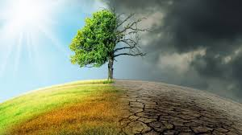

 

<h4> A Defining Crisis of Our Generation: Climate Change </h4>

 

<left><h7> Public Opinion Continues to Vary </h7></left>

 

 It is important now more than ever that the international community commits to 
addressing one of the defining crises of our time: climate change. Despite 
conflicting beliefs surrounding the science, the evidence is clear. Human-activity,
specifically the emission of carbon dioxide and other greenhouse gases, is the 
primary factor of our changing climate. Earth's climate is experiencing a 
transformation at rates never before seen, and the consequences may very well
be catastrophic. In order to decrease carbon emissions and slow the degradation
of the environment, sustained action is vital and necessary. It is one of the most
pressing issues of our generation, yet there are still those who refuse to 
acknowledge the severity of climate change, and cling to the belief that human
activity has not negatively impacted the health and wellbeing of our planet. 

 

